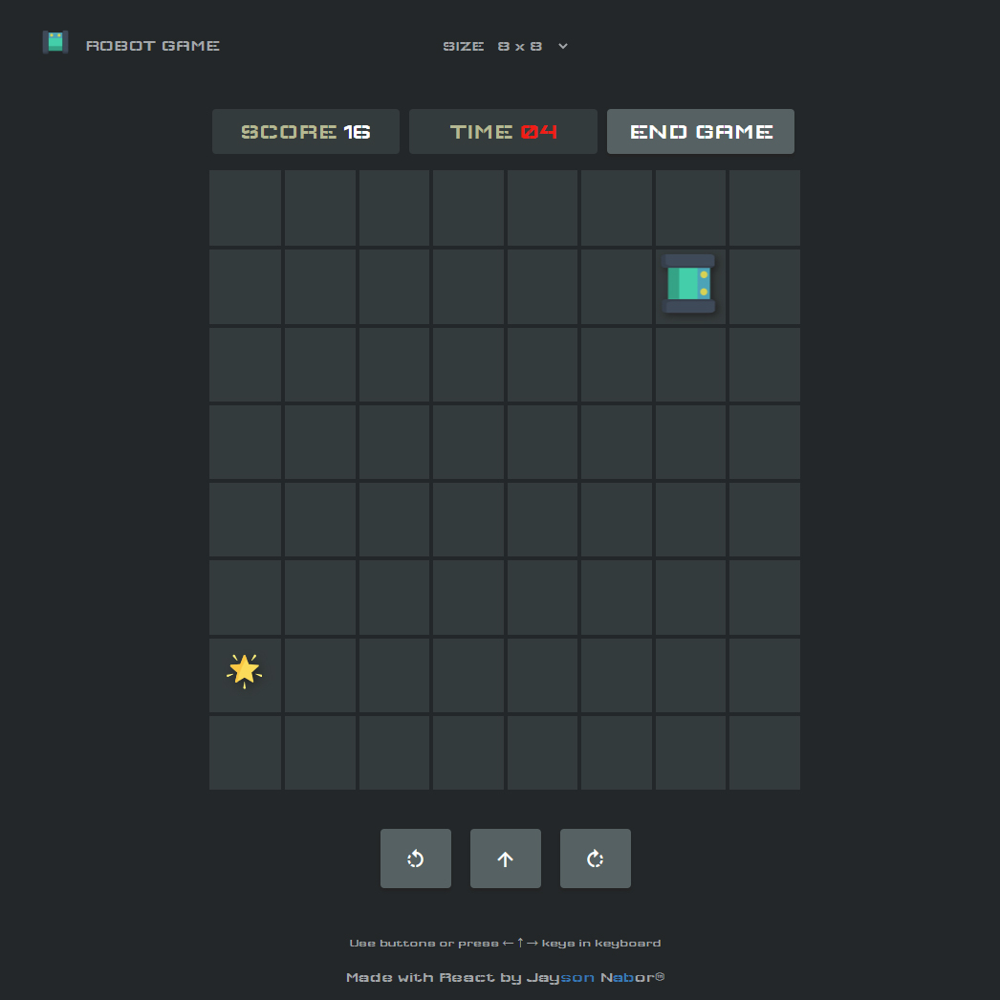
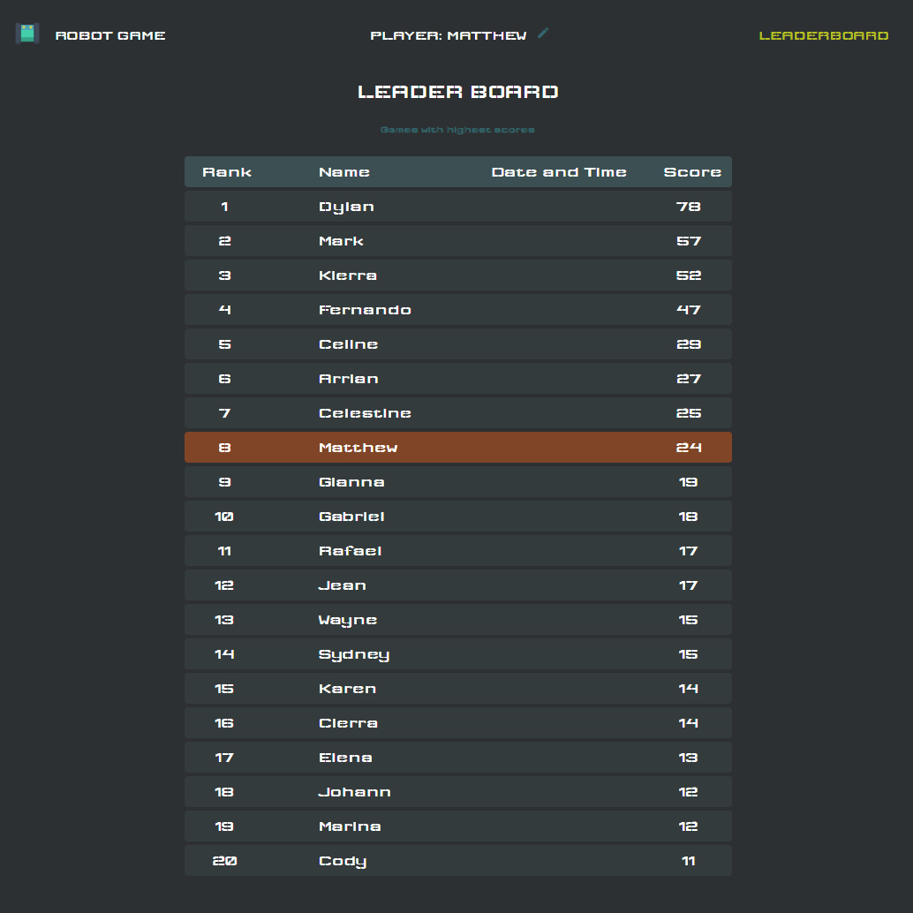

# react-robot-game

A robot game made with react, styled-components, and typescript.

## Pre-Requisites

You’ll need to have Node >= 8.10 and npm >= 5.6 on your machine

## Available Scripts

In the project directory, you can run:

### `npm start`

Runs the app in the development mode.<br />
Open [http://localhost:3000](http://localhost:3000) to view it in the browser.

The page will reload if you make edits.<br />
You will also see any lint errors in the console.

### `npm run build`

Builds the app for production to the `build` folder.<br />
It correctly bundles React in production mode and optimizes the build for the best performance.

The build is minified and the filenames include the hashes.<br />
Your app is ready to be deployed!

## Game configuration

Open src/config.js

Below are the default configurations. Take note that other configurations are not well tested.

```JavaScript
// configurations
export const GAME_GRIDS = 5 // n x n
export const GAME_DIMENSION = 600 // in pixels:  n x n
export const TIMER_START = 60 // in seconds
```

## Screen Capture

Game Page


Leaderboard Page


## Thank You

Pleas let me know if there are any issues or if you have any questions.

Jayson Nabor
<br />
https://jnabor.github.io
